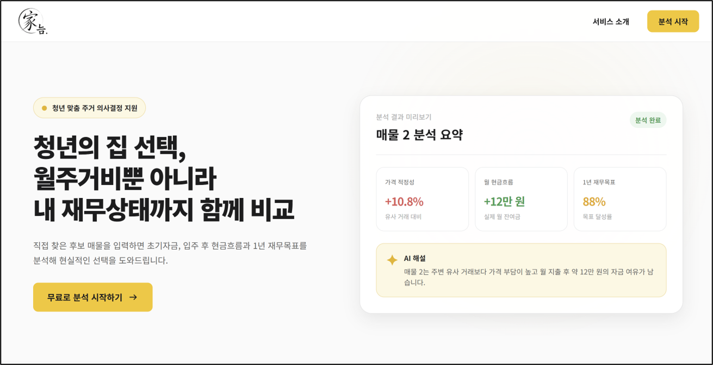
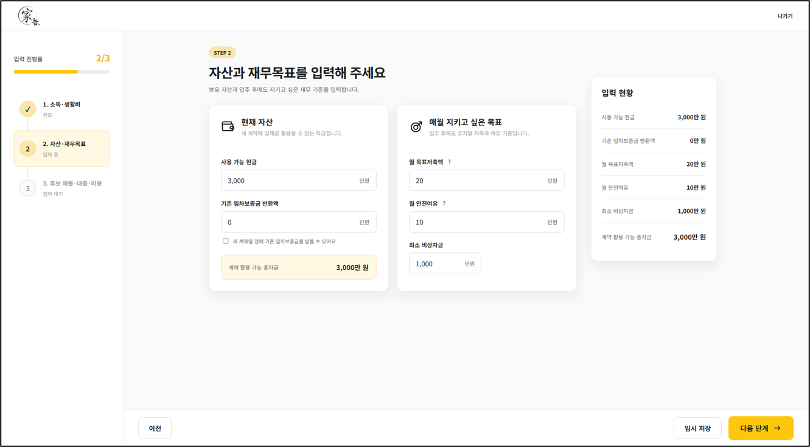
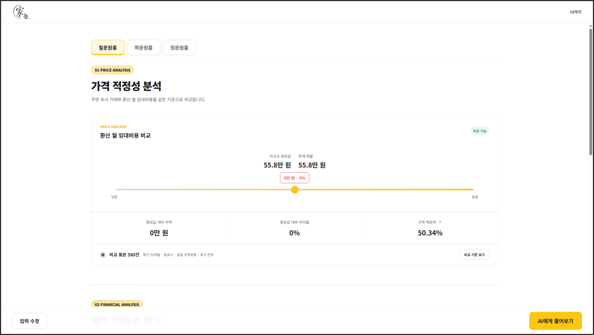
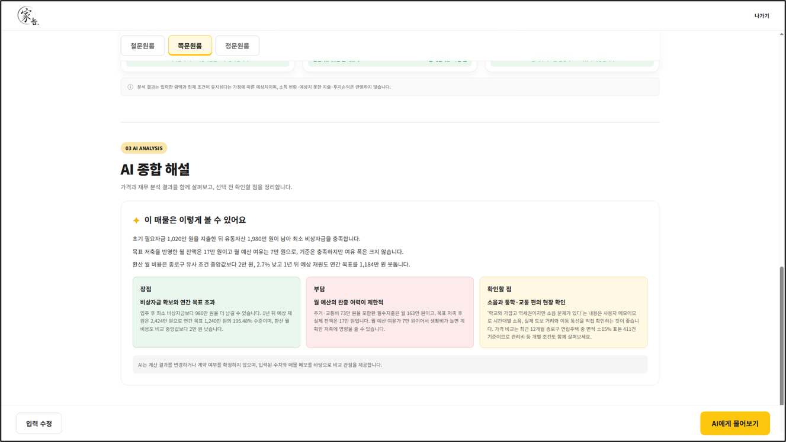
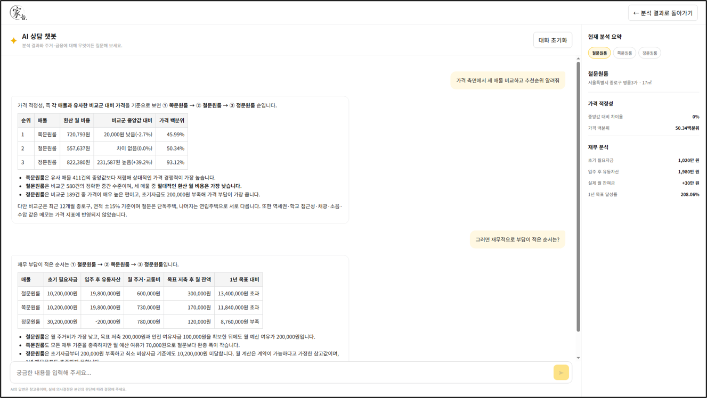
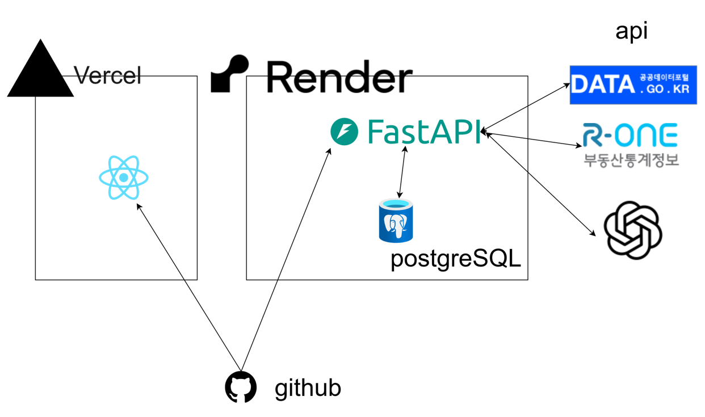

# 가늠
실거래 데이터와 개인 재무정보를 결합한 전월세 후보 비교 AI 에이전트

## 기술 스택

| 구분 | 기술 |
| --- | --- |
| Frontend | React 19, TypeScript, Vite |
| Backend | FastAPI, Python 3.10+, Pydantic |
| AI | Pydantic AI, OpenAI |
| Database | PostgreSQL, SQLAlchemy, asyncpg |
| Migration | Alembic |
| Test | Pytest, Vitest, React Testing Library, MSW |
| Infrastructure | Docker Compose, Vercel |

## 프로젝트가 하는 일

가늠은 청년 사용자가 자신의 재무 상태와 후보 주거지를 함께 비교해 주거 의사결정을 내릴 수 있도록 돕는 서비스입니다.

- 월 소득과 생활비를 바탕으로 현재 현금 흐름을 정리합니다.
- 보유 자산, 비상자금, 저축 목표를 반영해 가용 자금을 계산합니다.
- 전세·월세 후보 매물의 보증금, 대출, 이자 및 추가 비용을 비교합니다.
- 초기 자금, 월 현금 흐름, 1년 재무 목표 관점에서 매물별 결과를 제공합니다.
- 계산 결과와 승인된 데이터를 바탕으로 AI 후속 상담을 제공합니다.

## 화면

## 아키텍처

프론트엔드는 단계별 입력과 결과·상담 화면을 담당하고, FastAPI 백엔드는 요청 검증 후 서비스 계층에 처리를 위임합니다. 금융 수치는 AI가 아닌 결정론적 계산 로직에서 산출하며, AI는 저장된 분석 데이터와 계산 결과를 근거로 설명을 생성합니다. 데이터 접근은 Repository 계층으로 분리하고 PostgreSQL 스키마 변경은 Alembic으로 관리합니다.

## 문제 해결 및 성능 개선

| 문제 | 해결 방법 | 
| --- | --- |
| 분석 결과를 보여주는 과정에서 입력이 변하지 않았음에도 다시 처음부터 분석한다 | 각 분석 결과에 하나의 id를 부여해 sql에 저장 후 이전 입력에서 변한 것이 없다면 저장한 분석 결과를 반환한다 |
| 매물이나 사용자 정보 입력을 할 때 다음 페이지로 넘기면 무조건 서버에 요청을 날려서 요청이 너무 많다 | 입력 정보가 바뀐 부분이 있을 때만 서버에 요청을 보낸다 |
